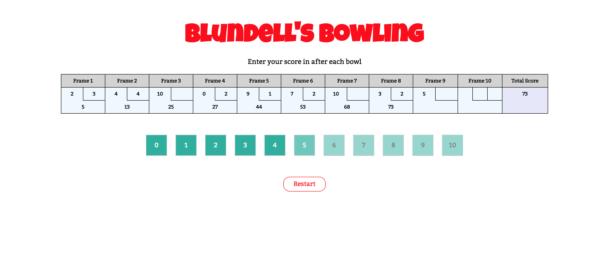

# Examen refactorización

Refactoriza el código Java proporcionado sin cambiar su comportamiento, es decir, de modo que siga pasando los casos test proporcionados e intenta encontrar el defecto que produce que falle el último de los casos test. 

La lógica de la aplicación es la que se explica en el epígrafe II.

## I - Configuración del proyecto y refactorización.

### 1- Configura un proyecto Maven en tu máquina.

Recuerda establecer en el archivo de configuración del proyecto todas las opciones que hemos tratado en nuestras sesiones del módulo.

### 2- Pon el proyecto en seguimiento _git_ en tu sistema de archivos local.

Excluye de seguimiento aquellos recursos que no procedan.

### 3- Crea un repo en github y añádeme como colaborador (usuario @dfleta).

### 4- Configura este repo como el remoto de tu proyecto en local.

### 5- Realiza commits de manera continua siguiendo las directrices propuestas en _conventional commits_.

Sin un desarrollo incremental del proyecto con commits categorizados según la propuesta de _conventional commits_ no corrijo el examen.

### 6- Trabaja con al menos 2 ramas.

Utiliza la recomendación _gitflow_.

### 7- Añade al proyecto las clases.

`PinPals.java` -> Clase principal
`ScoreCard.java` -> Lógica del aplicación
`ScoreCardTest.java` -> Casos test

#### 7.1 - Dependencia ASCII Table.

Incluye la dependencia al paquete [ASCII Table](https://mvnrepository.com/artifact/com.github.freva/ascii-table):

https://mvnrepository.com/artifact/com.github.freva/ascii-table

### 8- Crea el fichero `jar` ejecutable.

Configura el _plugin_ `jar` para generar un fichero `jar` **ejecutable** con la clase principal `PinPals.java`.

Además, tendrás que incluir el siguiente _plugin_ en el archivo de configuración del proyecto.

```xml
        <!-- mvn clean compile assembly:single -->
        <plugin>
          <artifactId>maven-assembly-plugin</artifactId>
          <configuration>
            <archive>
              <manifest>
                <mainClass>edu.gorillas.PinPals</mainClass>
              </manifest>
            </archive>
            <descriptorRefs>
              <descriptorRef>jar-with-dependencies</descriptorRef>
            </descriptorRefs>
          </configuration>
          <executions>
            <execution>
              <id>make-assembly</id>
              <phase>package</phase> <!-- bind to the packaging phase -->
              <goals>
                <goal>single</goal>
              </goals>
            </execution>
          </executions>
        </plugin>
```

Genera el fichero `jar` desde línea de comandos:

`mvn clean compile assembly:single`

Obtendrás un fichero llamado:

`artifactId-1.0-SNAPSHOT-jar-with-dependencies.jar`

Ejecuta este fichero `jar` desde la CLI (línea de comandos).

Debes obtener en consola una salida como esta, la representación en ASCII Art de una tarjeta con la puntuación de una partida de bolos.

```
Smokey, this is not Vietnam, this is bowling. There are rules. - The Dude

+---------+---------+---------+---------+---------+---------+---------+---------+---------+----------+
| Frame 1 | Frame 2 | Frame 3 | Frame 4 | Frame 5 | Frame 6 | Frame 7 | Frame 8 | Frame 9 | Frame 10 |
+---------+---------+---------+---------+---------+---------+---------+---------+---------+----------+
|   9 | - |   9 | - |   9 | - |   9 | - |   9 | - |   9 | - |   9 | - |   9 | - |   9 | - |    9 | - |
+---------+---------+---------+---------+---------+---------+---------+---------+---------+----------+
```

### 9- Refactoriza los casos test para que compilen con Junit 5.

Elimina del proyecto la dependencia a Junit 4 (en el caso en el que la hayas añadido anteriormente) y añade la dependencia a Junit 5.

### 10- Deshabilita mediante Junit 5 el caso test `calculateScoreTest9`

`calculateScoreTest9` es el caso test que falla y que pone de manifiesto la presencia de un defecto en el código. Deshabilítalo mediante JUnit 5 (deshabilitar no es eliminar del código ni convertirlo en comentarlos).

### 11- Refactoriza el código de los casos test y el código de la lógica de la aplicación para que cumpla con los estándares de código que hemos establecido en el módulo de contornos de desenvolvemento.

- Usa las listas de chequeo con las posibles refactorizaciones que proporcioné en clase.
- Puedes añadir comentarios en el código para explicar brevemente el motivo de la refactorización.
- Realiza commit tras cada refactorización.
- Asegúrate de que el código sigue pasando los casos test tras cada cambio.

### 12- Intenta encontrar el defecto en el código.

El defecto produce que el caso test `calculateScoreTest9` falle.

Explica cuál es el defecto.

Intenta corregir el código para que supere este caso test sin romper los anteriores.


## II. En la bolera



La lógica de la aplicación es la siguiente.

Dada una secuencia válida de tiradas para una partida de bolos, la aplicación devuelve la puntuación total del juego. 

Este es un resumen de las reglas del juego:

- Cada partida de bolos incluye diez turnos, o _frames_, para la persona lanzadora.
- En cada _frame_ el jugador realiza hasta dos intentos para derribar todos los bolos o _pins_.
- Si en dos intentos no logra derribar todos los bolos, su puntuación para ese _frame_ es el número total de bolos derribados en sus dos intentos.
- Si en dos intentos los derriba todos, consigue un _spare_ y su puntuación en el _frame_ es `10` más el número de bolos derribados en su siguiente intento. Consulta [cómo se calcula la puntuación obtenida en un _spare_](https://es.wikipedia.org/wiki/Spare).
- Si en su primer intento en el _frame_ derriba todos los bolos, consigue un _strike_. Su turno termina con ese primer lanzamiento (no lanza una segunda bola) y su puntuación en ese _frame_ es `10` más el total de los bolos derribados en sus dos siguientes lanzamientos. Consulta [cómo se computa la puntuación obtenida en un _strike_](https://es.wikipedia.org/wiki/Strike_(bowling)).
- Si obtiene un _spare_ o un _strike_ en el último (décimo) _frame_, el jugador puede lanzar una o dos bolas extra, respectivamente. Estas bolas extra forman parte del mismo turno. Si los tiros extra derriban todos los bolos, no se obtienen más tiradas extra. Los tiros extra sólo se utilizan para calcular la puntuación del último _frame_.
- La puntuación de la partida es la suma de las puntuaciones de todos los _frames_.
